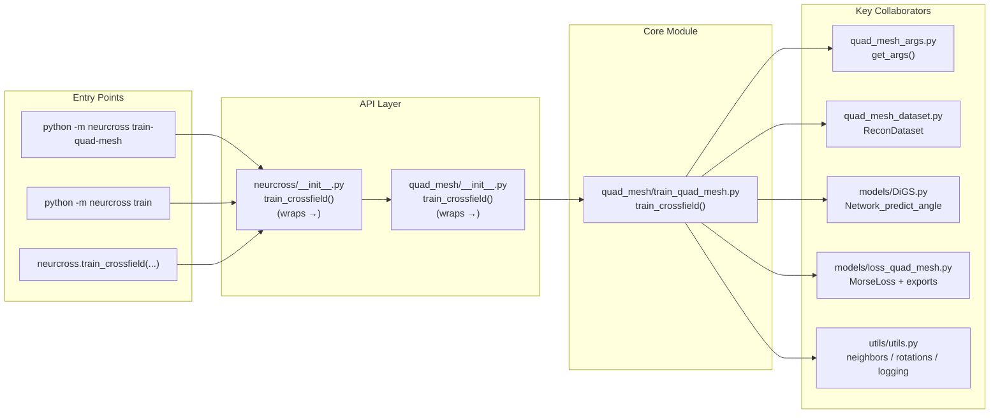

# NeurCross: A Neural Approach to Computing Cross Fields for Quad Mesh Generation

### [Project](https://qiujiedong.github.io/publications/NeurCross/) | [Paper](https://arxiv.org/pdf/2405.13745)

**This repository is the official PyTorch implementation of our
paper,  *NeurCross: A Neural Approach to Computing Cross Fields for Quad Mesh Generation*, ACM Transactions on Graphics (SIGGRAPH 2025).**


## Requirements

- Python 3.10 or newer
- PyTorch
- NumPy
- SciPy
- torchinfo
- timm
- trimesh
- torch_kmeans

CUDA is optional but recommended for practical training speed. The code falls back to CPU when CUDA is unavailable, but full training can be slow on CPU.

## Installation

```
git clone https://github.com/QiujieDong/NeurCross.git
cd NeurCross
```

## Build A Wheel

Install the build frontend, then create a wheel from the repository root:

```powershell
python -m pip install --upgrade build
python -m build --wheel
```

The generated wheel is written to `dist/`. The default wheel is a pure Python wheel, for example `neurcross-0.1.0-py3-none-any.whl`.

On Windows, you can use the helper script:

```powershell
.\build-wheel.ps1
```

To append optional Torch and CUDA build metadata to the wheel filename, use:

```powershell
.\build-wheel.ps1 -IncludeTorchVersion -IncludeCudaVersion
```

That produces a wheel name with a standard wheel build tag, for example:

```text
neurcross-0.1.0-1torch2120cu132-py3-none-any.whl
```

To install the built wheel:

```powershell
python -m pip install .\dist\neurcross-0.1.0-py3-none-any.whl
```

The package exposes a high-level module entry point:

```powershell
python -m neurcross --help
python -m neurcross train-quad-mesh --help
python -m neurcross generate-label --help
python -m neurcross build-dataset-index --help
python -m neurcross split-dataset --help
```

## Using NeurCross From Another Python Module

The installed package exposes a small programmatic API through `neurcross`:

- `neurcross.train_crossfield(...)`
- `neurcross.load_checkpoint(...)`
- `neurcross.load_trained_model(...)`
- `neurcross.predict_crossfield(...)`

Example:

```python
import neurcross

result = neurcross.train_crossfield(
    data_path=r"D:\path\to\mesh.ply",
    out_dir=r"D:\path\to\output",
    n_samples=1000,
    n_points=1000,
    num_epochs=4,
    save_checkpoint_interval=100,
    export_weights_only=True,
    fast_nondeterministic=True,
)

print(result.output_dir)
print(result.log_path)
print(result.checkpoint_path)
print(result.best_checkpoint_path)
print(result.weights_path)
print(result.total_elapsed_seconds)
print(result.stopped_early)
```

`train_crossfield(...)` returns a `TrainingResult` object with:

- `args`
- `output_dir`
- `log_path`
- `mesh_name`
- `total_elapsed_seconds`
- `stopped_early`
- `stop_summary`
- `checkpoint_path`
- `best_checkpoint_path`
- `weights_path`

If you prefer CLI-style argument forwarding from Python, `train_crossfield` also accepts `argv`:

```python
import neurcross

result = neurcross.train_crossfield(
    argv=[
        "--data_path", r"D:\path\to\mesh.ply",
        "--out_dir", r"D:\path\to\output",
        "--n_samples", "1000",
        "--n_points", "1000",
        "--num_epochs", "4",
    ]
)
```

You can also resume a training run from a full checkpoint:

```python
import neurcross

result = neurcross.train_crossfield(
    data_path=r"D:\path\to\mesh.ply",
    out_dir=r"D:\path\to\output",
    load_checkpoint=r"D:\path\to\output\mesh\checkpoints\final_checkpoint.pt",
    num_epochs=20,
)
```

For inference-oriented workflows, load a trained model from a checkpoint and run predictions directly:

```python
import neurcross

model, metadata = neurcross.load_trained_model(
    r"D:\path\to\output\mesh\checkpoints\best_checkpoint.pt"
)

output_pred, theta_output = neurcross.predict_crossfield(
    model,
    nonmanifold_points,
    manifold_points,
    angle_features=angle_features,
)
```

On Windows, programmatic `train_crossfield(...)` calls force `num_workers=0` by default to avoid Python multiprocessing recursively re-importing the caller script. If you want DataLoader worker processes from your own Python script, guard the script entry point and opt in explicitly:

```python
from multiprocessing import freeze_support
import neurcross


def main():
    result = neurcross.train_crossfield(
        data_path=r"D:\path\to\mesh.ply",
        out_dir=r"D:\path\to\output",
        num_workers=4,
        allow_multiprocessing_workers=True,
    )
    print(result.output_dir)


if __name__ == "__main__":
    freeze_support()
    main()
```

The source checkout includes `data/doubleTorus/input/doubleTorus.ply`, so `--data_path` can be omitted when training from the repo. The wheel does not bundle sample training data, so `--data_path` is required after installation.

## Overfitting

```powershell
python -m quad_mesh.train_quad_mesh
```

You can also override parameters from the command line:

```powershell
python -m quad_mesh.train_quad_mesh --data_path D:\path\to\mesh.ply --n_samples 10000 --lr 5e-5
```

Equivalent installed-package usage:

```powershell
python -m neurcross train-quad-mesh --data_path D:\path\to\mesh.ply --out_dir D:\path\to\output
```

Estimated runtime from the paper: for a triangular mesh with 50,000 faces, each optimization iteration takes about `68.34 ms`, and the default research setting uses `10,000` iterations. That corresponds to roughly `683.4` seconds, or about `11.4` minutes, for one full run under that configuration. Actual runtime in this repository will vary with GPU, PyTorch/CUDA version, mesh complexity, and your chosen `--n_samples` setting.

## `quad_mesh_args.py` Reference

The training entry point accepts the following arguments.

| Argument | Default | Purpose |
| --- | --- | --- |
| `--out_dir` | `None` | Optional output directory used for logs and training artifacts. If omitted, outputs are written beside the input mesh. The script creates a subdirectory named after the input mesh file. |
| `--model_name` | `model` | Model name placeholder for saved artifacts. The current training script keeps it for compatibility with the original project setup. |
| `--seed` | `3627473` | Random seed applied to PyTorch, NumPy, and Python's `random` module for reproducible runs. |
| `--data_path` | repo sample mesh if available, otherwise `None` | Path to the input surface mesh used for training. This must point to a mesh file supported by `trimesh`. It is required when running from an installed wheel. |
| `--n_samples` | `10000` | Number of dataset samples exposed per epoch through the dataset length. This directly affects the number of training iterations for each epoch. |
| `--n_points` | `15000` | Number of points sampled per training item for manifold and non-manifold point sets. Larger values increase memory and compute cost. |
| `--grid_res` | `256` | Uniform grid resolution parameter passed into the dataset. It is part of the original training configuration, though the current dataset code does not use it directly. |
| `--nonmnfld_sample_type` | `mixed` | Off-surface sampling strategy. `uniform` samples random points in the normalized volume, `near_surface` samples Gaussian offsets around sampled surface points, `mixed` blends uniform/near-surface/feature-biased samples, and `feature_biased` oversamples boundary and high-normal-variation faces. Legacy spellings `grid`, `gaussian`, and `combined` are still accepted as aliases. |
| `--near_surface_ratio` | `None` | Optional mixed-mode weight for near-surface off-manifold samples. When omitted, mixed mode uses the internal default ratio profile. |
| `--uniform_ratio` | `None` | Optional mixed-mode weight for uniform off-manifold samples. |
| `--feature_ratio` | `None` | Optional mixed-mode weight for feature-biased off-manifold samples. |
| `--boundary_ratio` | `0.5` | Blends feature-biased sampling between boundary emphasis and face-normal-variation emphasis. |
| `--near_surface_sigma` | `None` | Optional fixed Gaussian sigma for near-surface off-manifold sampling in normalized coordinates. If omitted, NeurCross derives a local sigma from face-center neighborhoods. |
| `--uniform_extent` | `None` | Optional normalized-space extent for uniform off-manifold sampling. If omitted, NeurCross uses the existing `grid_res`-driven range setting. |
| `--num_epochs` | `10` | Number of epochs to run. |
| `--lr` | `5e-5` | Adam learning rate used for optimizing the model. |
| `--grad_clip_norm` | `10.0` | Gradient clipping threshold. Set to `0` or a negative value to disable clipping. |
| `--batch_size` | `1` | Mini-batch size used by the PyTorch `DataLoader`. Larger values require more GPU memory. |
| `--load_path` | `None` | Optional weights-only path. If provided, the model weights are loaded before training starts. Do not combine with `--load_checkpoint`. |
| `--save_checkpoint_interval` | `50` | Saves a full training checkpoint every N global training steps. Set to `0` to disable periodic checkpoints. |
| `--save_best_only` | disabled | Saves periodic checkpoints only when the current total loss improves. The separate `best_checkpoint.pt` is still maintained when loss improves. |
| `--checkpoint_dir` | `None` | Directory for checkpoint files. If omitted, checkpoints are written to `<out_dir>\<mesh-name>\checkpoints\`. Relative paths are resolved under the mesh output directory. |
| `--load_checkpoint` | `None` | Full checkpoint path used to resume training, including model weights, optimizer state, metadata, loss history, early-stopper state, and random state. |
| `--export_weights_only` | disabled | Also writes `model_weights.pt` for inference-only or external loading workflows. |
| `--save_best_by` | `val_field_score` | Chooses which field label becomes the canonical packaged output. `train_field_score` preserves the original training-score behavior. `val_field_score` compares fixed validation-batch scores between the train-best checkpoint and the final model. `quad_score` is intentionally deferred until downstream NeuralQuad quad metrics exist. |
| `--eval_interval_steps` | `0` | Runs fixed validation-batch evaluation every `N` training steps and appends entries to `metrics/validation_history.json`. `0` disables in-loop validation and still writes final validation metrics. |
| `--export_interval_steps` | `500` | Exports intermediate cross-field snapshots every `N` training steps in addition to final export. |
| `--curriculum` | `none` | Optional staged loss-weight schedule. `default`, `cad`, and `organic` apply geometry, alignment, and smoothness stages across global training steps. |
| `--schedule_unit` | `step` | Curriculum scheduling unit. The current implementation uses global training steps. |
| `--geometry_stage_ratio` | `0.2` | Fraction of total training steps reserved for geometry stabilization when curriculum is enabled. |
| `--alignment_stage_ratio` | `0.6` | Fraction of total training steps reserved for field-alignment emphasis when curriculum is enabled. |
| `--smooth_stage_ratio` | `0.2` | Fraction of total training steps reserved for smoothness cleanup when curriculum is enabled. |
| `--keep_last_n_checkpoints` | `3` | Number of recent periodic `checkpoint_step_*.pt` files to keep. Set to `0` to keep all periodic checkpoints. |
| `--num_workers` | `4` | Number of `DataLoader` worker processes used for training batches. |
| `--persistent_workers` | disabled | Keeps `DataLoader` workers alive across epochs to reduce worker startup overhead. |
| `--fast_nondeterministic` | disabled | Allows faster nondeterministic CUDA/cuDNN behavior instead of fully deterministic seeding. |
| `--device` | `auto` | Training device. `auto` uses CUDA when available, otherwise CPU. Use `cpu` to avoid GPU memory pressure or `cuda` to require CUDA. |
| `--max_topology_memory_gb` | `8.0` | Preflight guard for cached mesh topology tensors. If the estimated cache exceeds this value, training stops before allocation with guidance. Set to `0` or a negative value to disable the guard. |
| `--log_interval` | `10` | Number of batches between training log updates. |
| `--init_type` | `siren` | Decoder initialization strategy. The help text lists `siren`, `geometric_sine`, `geometric_relu`, and `mfgi`. |
| `--decoder_hidden_dim` | `256` | Width of the decoder hidden layers. |
| `--decoder_n_hidden_layers` | `4` | Number of hidden layers used in the decoder network. |
| `--latent_size` | `0` | Latent code size placeholder. The current quad mesh training path keeps this for compatibility with the original architecture. |
| `--nl` | `sine` | Nonlinearity used by the network, such as `sine`, `relu`, or `softplus`. |
| `--sphere_init_params` | `[1.6, 0.1]` | Parameters controlling sphere-based initialization behavior, interpreted by the model initialization code as radius and scaling values. |
| `--udf` | disabled | Enables unsigned distance field behavior in the model if specified. |
| `--output_any` | disabled | Optional flag preserved from the original project. It toggles alternate output behavior where supported by downstream code. |
| `--loss_type` | `siren_wo_n_w_morse_w_theta` | Selects the configured loss composition used by the quad mesh training pipeline. |
| `--decay_params` | `[3, 0.2, 3, 0.4, 0.001, 0]` | Parameters controlling scheduled decay behavior inside the Morse loss update step. |
| `--morse_type` | `l1` | Norm type used for the Morse divergence term. The help text lists `l1` and `l2`. |
| `--morse_decay` | `linear` | Decay schedule for Morse-loss weighting. Supported values in the help text are `none`, `step`, and `linear`. |
| `--loss_weights` | `[7000.0, 600.0, 10, 50.0, 30, 3]` | Per-term loss weights, documented in code as `sdf`, `inter`, `normal`, `eikonal`, `div`, and `morse`. |
| `--morse_near` | disabled | If enabled, the Morse loss uses the sampled `near_points` in addition to the default point sets. |
| `--weight_for_morse` | disabled | If enabled, reweights the Morse term according to the distance of each sampled point. |
| `--use_morse_nonmnfld_grad` | `True` | Controls whether Morse loss is applied to non-manifold gradients. |
| `--relax_morse` | `0.5` | Upper bound used by the relaxed Morse formulation. |
| `--use_vertices` | `False` | Controls whether to use vertices directly instead of the default sampled points. The code comment suggests `False` is used to avoid overfitting. |
| `--featureLine_threshold` | `1.0` | Threshold related to feature-line behavior in the cross-field pipeline. |
| `--early_stop` | disabled | Enables early stopping based on smoothed loss plateau detection and optional theta-term thresholds. |
| `--early_stop_min_steps` | `1000` | Minimum number of global training steps before early stopping can trigger. |
| `--early_stop_patience` | `500` | Number of steps without sufficient smoothed-loss improvement before plateau stopping triggers. |
| `--early_stop_min_delta` | `1e-3` | Minimum smoothed-loss improvement required to reset early-stop patience. |
| `--early_stop_smooth_window` | `50` | Moving-average window size used for smoothing the total loss for early stopping. |
| `--early_stop_check_interval` | `10` | Evaluate the early-stop controller every `N` global steps. |
| `--early_stop_target_loss` | `None` | Optional smoothed total-loss target that can stop training once the minimum-step guard is satisfied. |
| `--early_stop_theta_neighbor_threshold` | `None` | Optional maximum unweighted theta-neighbor term required before early stopping is allowed. |
| `--early_stop_theta_hessian_threshold` | `None` | Optional maximum unweighted theta-hessian term required before early stopping is allowed. |

Notes:

- Boolean flags defined with `action='store_true'` such as `--udf`, `--output_any`, `--morse_near`, and `--weight_for_morse` are disabled by default and become enabled when the flag is present.
- `--use_morse_nonmnfld_grad` and `--use_vertices` use `type=bool`, so if you pass them explicitly on the command line, use forms such as `--use_vertices True` or `--use_vertices False`.
- Some arguments are preserved from the original research code even when the current training path uses them lightly or not at all. The table above reflects the behavior of the current repository state.

Sampling notes:

- The current default is `mixed`, which combines uniform, near-surface, and feature-biased off-manifold samples.
- `mixed` mode uses deterministic weighted allocation across uniform, near-surface, and feature-biased samples.
- Dataset sampling is now deterministic for a fixed `--seed`, with epoch-specific variation driven through the training loop.

## Dataset Label Packages and Splits

`python -m neurcross generate-label` wraps preflight, normalization, training, validation export, and dataset packaging around a single mesh run.

Typical package layout:

```text
<dataset_root>\
  accepted\
    <sample_id>\
      manifest.json
      input\
      fields\
      geometry\
      metrics\
      logs\
  quarantine\
  failed\
```

The destination is driven by the generated quality report:

- `accepted/`: completed samples that pass the configured gate
- `quarantine/`: completed samples that are usable for inspection but fail the clean-dataset gate
- `failed/`: setup or training failures that still produced a diagnostic manifest

Preflight status classes:

- `accepted_for_training`: the mesh is usable as-is or only needed conservative cleanup such as dropping invalid or degenerate faces
- `needs_repair`: the mesh is still processable, but the report recorded warnings or repairs you may want to handle upstream before trusting the label
- `skip`: the mesh is not trainable under the current policy; NeurCross writes diagnostics and a skipped manifest instead of starting optimization

Optional geometry-supervision artifacts:

- `sdf/sdf_samples.npz` is written when `--export_sdf_samples` is enabled
- the NPZ contains `query_points`, `sdf_values`, `tsdf_values`, `sample_type`, `sign_reliability`, normalization metadata, and `mesh_is_watertight`
- for non-watertight meshes, NeurCross falls back to unsigned distance behavior and marks sign reliability accordingly instead of pretending the sign is trustworthy

Quality grades:

- `A`: clean field label that passed the configured gate
- `B`: acceptable field with warnings
- `C`: completed run routed to `quarantine/`
- `D`: skipped or failed run, typically routed to `failed/` or retained only for diagnostics

Example label-generation command:

```powershell
python -m neurcross generate-label `
  --data_path D:\meshes\cube.obj `
  --dataset_root D:\datasets\neurcross `
  --sample_id cube-baseline `
  --device cuda `
  --nonmnfld_sample_type mixed `
  --save_best_by val_field_score `
  --export_sdf_samples `
  --export_features `
  --quality_gate default
```

After samples exist, NeurCross can build a dataset index and deterministic shape-level splits:

```powershell
python -m neurcross build-dataset-index `
  --dataset_root D:\datasets\neurcross `
  --validate_artifacts
```

```powershell
python -m neurcross split-dataset `
  --dataset_root D:\datasets\neurcross `
  --seed 17 `
  --train_ratio 0.8 `
  --validation_ratio 0.1 `
  --test_ratio 0.1
```

`split-dataset` groups by source mesh hash so shape variants do not cross the clean train, validation, and test splits. `quarantine` and `failed` samples are tracked separately and are not mixed into the clean accepted splits.

Optional OOD holdout is supported at the source-dataset-family level:

```powershell
python -m neurcross split-dataset `
  --dataset_root D:\datasets\neurcross `
  --ood_source_dataset abc_parts `
  --ood_source_dataset mechcad_eval
```

or:

```powershell
python -m neurcross split-dataset `
  --dataset_root D:\datasets\neurcross `
  --ood_ratio 0.25
```

`--ood_source_dataset` explicitly holds out one or more `source.source_dataset` families into `ood_test`. `--ood_ratio` randomly selects that fraction of distinct source-dataset families, using the provided `--seed`. If no `source_dataset` metadata is present, OOD assignment stays disabled.

## GPU Memory Guards

NeurCross caches padded mesh-topology tensors for theta-neighbor and cross-field metrics. These tensors scale with mesh connectivity, not with `--n_points`, so reducing point samples does not always reduce peak GPU memory.

Use these controls when CUDA memory is tight:

```powershell
python -m neurcross train-quad-mesh `
  --data_path D:\path\to\mesh.ply `
  --device cpu
```

```powershell
python -m neurcross train-quad-mesh `
  --data_path D:\path\to\mesh.ply `
  --device cuda `
  --max_topology_memory_gb 4
```

`--device cpu` avoids CUDA OOM at the cost of runtime. `--max_topology_memory_gb` stops oversized topology allocations before they happen and prints guidance. If CUDA still runs out of memory during forward or backward computation, the training command raises a targeted error suggesting CPU fallback or mesh simplification.

## Checkpoints, Resume, and Model Export

Training now writes reusable PyTorch checkpoints that can be used to resume interrupted runs or load a trained model for inference. By default, checkpoint files are written under:

```text
<out_dir>\<mesh-name>\checkpoints\
```

The main files are:

- `checkpoint_step_<N>.pt`: periodic full training checkpoints.
- `best_checkpoint.pt`: the best-loss checkpoint seen so far.
- `final_checkpoint.pt`: the final model and optimizer state at the end of the run.
- `early_stop_checkpoint.pt`: the state saved immediately before an early-stop exit, when early stopping triggers.
- `model_weights.pt`: weights-only export, written when `--export_weights_only` is set.

Each full checkpoint includes model weights, optimizer state, training metadata, loss history, random state, and early-stopper state when early stopping is enabled.

Basic checkpointed training:

```powershell
python -m neurcross train-quad-mesh `
  --data_path D:\path\to\mesh.ply `
  --out_dir D:\path\to\output `
  --num_epochs 20 `
  --save_checkpoint_interval 100 `
  --export_weights_only
```

Resume from a full checkpoint:

```powershell
python -m neurcross train-quad-mesh `
  --data_path D:\path\to\mesh.ply `
  --out_dir D:\path\to\output `
  --load_checkpoint D:\path\to\output\mesh\checkpoints\final_checkpoint.pt `
  --num_epochs 30
```

Use `--load_path` only for loading a weights-only state dict. Use `--load_checkpoint` when you want a true training resume with optimizer and progress state restored.

## Fine-Tuning From a Previous Shape

Checkpoints can also seed a new shape run. There are two useful workflows:

- Use `--load_checkpoint` when you want to continue a run with the saved optimizer state and training metadata.
- Use `--load_path` with `model_weights.pt` when you want to reuse learned weights on a different mesh while starting a fresh optimizer schedule.

Train a source shape and export weights:

```powershell
python -m neurcross train-quad-mesh `
  --data_path D:\meshes\shape_a.ply `
  --out_dir D:\runs\neurcross `
  --num_epochs 20 `
  --save_checkpoint_interval 100 `
  --export_weights_only
```

Fine-tune on a target shape with a fresh optimizer:

```powershell
python -m neurcross train-quad-mesh `
  --data_path D:\meshes\shape_b.ply `
  --out_dir D:\runs\neurcross `
  --load_path D:\runs\neurcross\shape_a\checkpoints\model_weights.pt `
  --lr 1e-5 `
  --num_epochs 10 `
  --save_checkpoint_interval 100 `
  --export_weights_only
```

Resume the exact source-shape run instead:

```powershell
python -m neurcross train-quad-mesh `
  --data_path D:\meshes\shape_a.ply `
  --out_dir D:\runs\neurcross `
  --load_checkpoint D:\runs\neurcross\shape_a\checkpoints\final_checkpoint.pt `
  --num_epochs 30
```

## Sharing Pretrained Checkpoints

A shared checkpoint should be a small directory or archive that contains enough context for another user to load the model, understand how it was trained, and decide whether it is compatible with their run.

Recommended layout:

```text
neurcross-<model-name>-<date>\
  README.md
  best_checkpoint.pt
  model_weights.pt
  metadata.json
  sample_command.txt
```

Use these conventions:

- Name packages with the project, model or dataset label, and date, for example `neurcross-doubletorus-baseline-2026-06-10`.
- Include `best_checkpoint.pt` when sharing a resumable training artifact.
- Include `model_weights.pt` when sharing an inference or fine-tuning artifact.
- Include a short `README.md` that states the source mesh or dataset family, NeurCross version or commit, device used for training, approximate training steps, and any notable flags such as `--udf`, `--morse_near`, or custom architecture settings.
- Include `metadata.json` if you want a human-readable sidecar; it is not generated automatically, but can be derived from the full checkpoint metadata.
- Include `sample_command.txt` with the exact command used to train or fine-tune the checkpoint.
- Do not rename architecture-critical files after export unless the README clearly documents the mapping.

Compatibility expectations:

- Full checkpoints are intended for `--load_checkpoint` and require compatible model architecture settings from the saved metadata.
- Weights-only files are intended for `--load_path` and require the new run to use the same architecture settings, including `--decoder_hidden_dim`, `--decoder_n_hidden_layers`, `--nl`, `--init_type`, `--sphere_init_params`, `--udf`, and `--latent_size`.
- A checkpoint trained on one mesh can be useful for fine-tuning another mesh, but it is not guaranteed to improve convergence or output quality for unrelated geometry.
- Treat externally shared `.pt` files as executable PyTorch artifacts. Only load checkpoints from trusted sources.

Example consumer commands:

```powershell
python -m neurcross train-quad-mesh `
  --data_path D:\meshes\target.ply `
  --out_dir D:\runs\neurcross `
  --load_path D:\models\neurcross-doubletorus-baseline-2026-06-10\model_weights.pt `
  --lr 1e-5 `
  --num_epochs 10
```

```python
import neurcross

model, metadata = neurcross.load_trained_model(
    r"D:\models\neurcross-doubletorus-baseline-2026-06-10\best_checkpoint.pt"
)
```

## Early Stopping

NeurCross supports opt-in early stopping based on smoothed total-loss plateau detection. This is intended as a practical time-saving guard, not a replacement for downstream field or remeshing validation.

Example:

```powershell
python -m neurcross train-quad-mesh `
  --data_path D:\path\to\mesh.ply `
  --out_dir D:\path\to\output `
  --num_epochs 20 `
  --early_stop `
  --early_stop_min_steps 2000 `
  --early_stop_patience 1000 `
  --early_stop_smooth_window 100 `
  --early_stop_theta_neighbor_threshold 1e-3 `
  --early_stop_theta_hessian_threshold 1e-3
```

When early stopping triggers, the current field is still exported and marked as the final output.

### Cross-field Snapshots

NeurCross saves intermediate cross-field snapshots under:

```text
<out_dir>\<mesh-name>\save_crossField\
```

The current export manager preserves history snapshots and also maintains stable aliases:

```text
save_crossField\
  <mesh-name>_iter_<global_step>.vec
  <mesh-name>_latest.vec
  <mesh-name>_best.vec
  <mesh-name>_final.vec
  <mesh-name>_latest.meta.txt
  <mesh-name>_best.meta.txt
  <mesh-name>_final.meta.txt
```

`latest` is overwritten every export, `best` is updated when the field-quality score improves, and `final` is written when training completes or stops early.

The preserved `*_iter_<global_step>.vec` snapshots use the global training step, so multi-epoch runs no longer overwrite earlier exports.

NeurCross now treats `.vec` as its only field artifact output. Downstream field conversion and quad extraction belong in NeuralQuad.

## Metrics Reporting

Every preserved cross-field export has a matching JSON metrics report under:

```text
<out_dir>\<mesh-name>\metrics\
```

The metrics directory contains:

```text
metrics\
  <mesh-name>_iter_<global_step>.json
  <mesh-name>_latest.json
  <mesh-name>_best.json
  <mesh-name>_final.json
```

Each report records:

- training losses: total, manifold, non-manifold, eikonal, Morse, theta-Hessian, theta-neighbor
- field-validity metrics: tangency, norm error, orthogonality, handedness, flipped-frame ratio, NaN count
- field-smoothness metrics: adjacent cross-field error mean, median, p95, and max
- singularity proxy metrics
- a composite field score used to rank `best`

The current `best` snapshot is selected using a field-oriented score derived from theta alignment, neighboring smoothness, tangency error, and flipped-frame ratio.

## Cite

If you find our work useful for your research, please consider citing our paper.

```bibtex
@article{Dong2025NeurCross,
author={Dong, Qiujie and Wen, Huibiao and Xu, Rui and Chen, Shuangmin and Zhou, Jiaran and Xin, Shiqing and Tu, Changhe and Komura, Taku and Wang, Wenping},
title={NeurCross: A Neural Approach to Computing Cross Fields for Quad Mesh Generation},
journal={ACM Trans. Graph.},
publisher={Association for Computing Machinery},
address={New York, NY, USA},
year={2025},
volume={44},
number={4},
url={https://doi.org/10.1145/3731159},
doi={10.1145/3731159}
}
```


## Acknowledgments

Our code is inspired by [NeurCADRecon](https://github.com/QiujieDong/NeurCADRecon)
and [SIREN](https://github.com/vsitzmann/siren).
We would like to thank the authors
of [pyquadwild](https://github.com/dickoah/pyquadwild).


## Call Chain

The diagram below shows how a training request flows from the public API down to the core training loop.



### Notes on the diagram

- **Entry points:** `python -m neurcross train-quad-mesh`, `python -m neurcross train`, and `python -m quad_mesh.train_quad_mesh` all converge on the same core function.
- **API wrappers:** Both `neurcross/__init__.py` and `quad_mesh/__init__.py` are thin wrappers that delegate to the real implementation in `quad_mesh/train_quad_mesh.py`.
- **Core training:** `train_crossfield()` orchestrates dataset creation, model instantiation, the optimizer, the loss computation, checkpoint save/resume, the early-stopping controller, and periodic cross-field export.
- **Key helpers:** `quad_mesh_args` resolves CLI arguments; `ReconDataset` provides point batches; `Network_predict_angle` is the neural network; `MorseLoss` computes the composite loss plus coordinates snapshot exports; and `utils/utils.py` handles mesh neighbor/rotation precomputation and logging.

## Training Flow Diagram

```mermaid

flowchart TD
    Start([Start: train_crossfield]) --> InitArgs[Initialize Arguments<br/>_build_training_args]
    InitArgs --> ConfigWorkers[Configure DataLoader Workers<br/>_configure_programmatic_dataloader_workers]
    ConfigWorkers --> CheckDataPath{Data Path Provided?}
    CheckDataPath -- No --> RaiseError[Raise ValueError]
    CheckDataPath -- Yes --> LoadDeps[Load Runtime Dependencies<br/>torch, optim, Network_predict_angle,<br/>MorseLoss, utils, dataset]

    LoadDeps --> SetupOutputDir[Setup Output Directory<br/>Based on data_path and out_dir]
    SetupOutputDir --> SetupLogging[Setup Logging<br/>utils.setup_out_dir_only_log]
    SetupLogging --> SetupDevice[Setup Device<br/>CPU or CUDA]

    SetupDevice --> SetSeed[Set Random Seed<br/>utils.same_seed]
    SetSeed --> CreateDataset[Create ReconDataset<br/>train_set = ReconDataset]
    CreateDataset --> GetStaticBatch[Get Static Batch<br/>static_batch = train_set.get_static_batch]

    GetStaticBatch --> CreateDataLoader[Create Train DataLoader<br/>batch_size, shuffle, num_workers]
    CreateDataLoader --> CalcSteps[Calculate Steps<br/>steps_per_epoch, total_steps]
    CalcSteps --> LogSchedule[Log Training Schedule]

    LogSchedule --> MoveToGPU_Static[Move Static Data to Device<br/>mnfld_points_base, mnfld_n_gt,<br/>local_coord_u, local_coord_v]
    MoveToGPU_Static --> CreateAngleFeatures[Create Angle Features<br/>angle_feature_static = cat<br/>mnfld_n_gt, local_coord_u, local_coord_v]

    CreateAngleFeatures --> CreateNetwork[Create Network<br/>Network_predict_angle<br/>in_dim=3, angle_in_dim=12]
    CreateNetwork --> MoveNetToDevice[Move Network to Device]
    MoveNetToDevice --> CheckLoadPath{Weights Path Provided?}
    CheckLoadPath -- Yes --> LoadModel[Load Model State Dict]
    CheckLoadPath -- No --> SkipLoad[Skip Loading]
    LoadModel --> PrintSummary[Print Model Summary<br/>torchinfo.summary]
    SkipLoad --> PrintSummary
    PrintSummary --> CountParams[Count Parameters<br/>utils.count_parameters]

    CountParams --> CreateOptimizer[Create Adam Optimizer<br/>lr=args.lr, weight_decay=0.0]
    CreateOptimizer --> CheckResumeCheckpoint{Resume Checkpoint Provided?}
    CheckResumeCheckpoint -- Yes --> LoadCheckpoint[Load Model, Optimizer,<br/>Metadata, RNG, and Resume State]
    CheckResumeCheckpoint -- No --> SkipCheckpoint[Start Fresh]
    LoadCheckpoint --> GetVertexNeighbors[Get Vertex Neighbors<br/>utils.get_sample_vers_neighbors_for_face_center_points_or_vertices]
    SkipCheckpoint --> GetVertexNeighbors
    GetVertexNeighbors --> CalcSameNeighbors[Calculate Same Neighbors<br/>utils.calculate_same_neighbors_verts]
    CalcSameNeighbors --> GetRotationMatrix[Get Rotation Matrix<br/>utils.get_rotation_matrix]

    GetRotationMatrix --> CreateLoss[Create MorseLoss Criterion<br/>weights, loss_type, div_decay,<br/>vertex_neighbors, axis_angle_R_mat_list]
    CreateLoss --> CreateEarlyStopper{Early Stop Enabled?}
    CreateEarlyStopper -- Yes --> InitEarlyStopper[Initialize EarlyStopper<br/>min_steps, patience, min_delta,<br/>smooth_window, check_interval,<br/>target_loss, theta thresholds]
    CreateEarlyStopper -- No --> SkipEarlyStop[Skip Early Stopping]
    InitEarlyStopper --> LogEarlyStop[Log Early Stop Configuration]
    SkipEarlyStop --> LogEarlyStop
    LogEarlyStop --> SetNetTrain[Set Network to Train Mode<br/>net.train]

    SetNetTrain --> StartEpoch[FOR each epoch in range:num_epochs]

    subgraph EpochLoop [Epoch Loop]
        direction TB
        StartEpoch --> BatchLoop[FOR each batch_idx, data in train_dataloader]

        subgraph BatchLoopSub [Batch Loop]
            direction TB
            BatchLoop --> BatchStart[Record Batch Start Time]
            BatchStart --> CalcGlobalStep[Calculate Global Step<br/>global_step = epoch * steps_per_epoch + batch_idx]
            CalcGlobalStep --> CheckSaveBest{batch_idx % 500 == 0<br/>OR last batch?}
            CheckSaveBest -- Yes --> SetSaveBest[SAVE_BEST = True]
            CheckSaveBest -- No --> CheckFinalBatch{Is Final Batch?}
            SetSaveBest --> CheckFinalBatch
            CheckFinalBatch -- Yes --> SetFinalFlag[is_final_batch = True]
            CheckFinalBatch -- No --> SetFinalFlag2[is_final_batch = False]
            SetFinalFlag --> ZeroGrad[optimizer.zero_grad set_to_none=True]
            SetFinalFlag2 --> ZeroGrad

            ZeroGrad --> ClonePoints[Clone & Enable Gradients<br/>mnfld_points.clone, requires_grad_<br/>nonmnfld_points.requires_grad_<br/>near_points.requires_grad_]
            ClonePoints --> ConcatFeatures[Concatenate Features<br/>features = cat mnfld_points, angle_feature_static]
            ConcatFeatures --> ForwardPass[Forward Pass<br/>output_pred, mnfld_pts_theta_output_pred =<br/>net nonmnfld_points, mnfld_points,<br/>near_points, angle_features]

            ForwardPass --> ComputeLoss[Compute Loss<br/>loss_dict = criterion<br/>output_pred, mnfld_points, nonmnfld_points,<br/>mnfld_n_gt, near_points,<br/>mnfld_pts_theta_output_pred,<br/>local_coord_u, local_coord_v,<br/>save_best, is_final_export]
            ComputeLoss --> Backward[Backward Pass<br/>loss_dict loss backward]
            Backward --> GradClip{Grad Clip Norm > 0?}
            GradClip -- Yes --> ClipGradients[Clip Grad Norm<br/>torch.nn.utils.clip_grad_norm_]
            GradClip -- No --> SkipClip[Skip Gradient Clipping]
            ClipGradients --> ResetSaveBest[SAVE_BEST = False]
            SkipClip --> ResetSaveBest

            ResetSaveBest --> OptimizerStep[optimizer.step]
            OptimizerStep --> SaveCheckpoint{Checkpoint Due<br/>or New Best Loss?}
            SaveCheckpoint -- Yes --> WriteCheckpoint[Write Checkpoint]
            SaveCheckpoint -- No --> RecordBatchTime[Record Batch Elapsed Time]
            WriteCheckpoint --> RecordBatchTime
            RecordBatchTime --> CheckLogInterval{batch_idx % log_interval == 0?}
            CheckLogInterval -- Yes --> LogStats[Log Training Statistics<br/>Loss components, weights, lr,<br/>timing information]
            CheckLogInterval -- No --> CheckEarlyStopInner

            LogStats --> CheckEarlyStopInner{Early Stopper Enabled?}
            CheckEarlyStopInner -- No --> UpdateMorseWeight
            CheckEarlyStopInner -- Yes --> UpdateEarlyStopper[Update EarlyStopper<br/>early_stopper.update<br/>global_step, loss, theta_neighbors,<br/>theta_hessian]
            UpdateEarlyStopper --> CheckStopTriggered{Stop Triggered?}
            CheckStopTriggered -- Yes --> ExportSnapshot[Export Crossfield Snapshot<br/>export_crossfield_snapshot<br/>vector_alpha, vector_beta,<br/>total_loss, field_score, metrics]
            ExportSnapshot --> WriteEarlyStopCheckpoint[Write Early Stop Checkpoint]
            WriteEarlyStopCheckpoint --> LogEarlyStopMsg[Log Early Stop Message]
            LogEarlyStopMsg --> SetStoppedEarly[stopped_early = True]
            SetStoppedEarly --> BreakBatch[BREAK from Batch Loop]
            CheckStopTriggered -- No --> UpdateMorseWeight

            UpdateMorseWeight[Update Morse Weight<br/>criterion.update_morse_weight<br/>global_step, total_steps, decay_params]
            UpdateMorseWeight --> BatchLoopEnd{Next Batch?}
        end

        BatchLoopEnd -- Yes --> BatchLoop
        BatchLoopEnd -- No --> CheckEpochStop
        BreakBatch --> CheckEpochStop{stopped_early?}
    end

    CheckEpochStop -- Yes --> TrainingComplete[Training Complete]
    CheckEpochStop -- No --> StartEpoch

    TrainingComplete --> CalcTotalElapsed[Calculate Total Elapsed Time]
    CalcTotalElapsed --> LogFinal[Log Final Message<br/>Stopped early or Finished]
    LogFinal --> WriteFinalCheckpoint[Write Final Checkpoint<br/>and Optional model_weights.pt]
    WriteFinalCheckpoint --> CloseLogFile[Close Log File]
    CloseLogFile --> ReturnResult[Return TrainingResult<br/>args, output_dir, log_path,<br/>mesh_name, checkpoint paths,<br/>total_elapsed_seconds, stopped_early, stop_summary]
    ReturnResult --> End([End])

    style Start fill:#90EE90
    style End fill:#FFB6C1
    style RaiseError fill:#FF6B6B
    style ExportSnapshot fill:#FFE4B5
    style ReturnResult fill:#87CEEB

```


